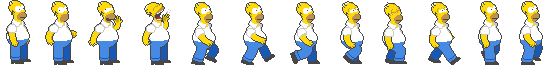

# Donut Runner

[Play here!](http://game.edcarladraincem.com)


### Background

Donut Runner is a hybrid of the classic arcade game, The Simpsons (by Konami), and addictive endless runner games such as Temple Run and Google Chrome's Dino Runner. It is written in JavaScript with HTML and CSS.

### How to Play

Homer needs his donuts and there are people in his way. The only way to get past these characters is by jumping! Use the `spacebar` to jump over Barney, Selma, Martin, and Milhouse. Don't let them stop you!

- Press `p` to pause the game
- Press `r` to reset the game when the game is over

## Feature Highlights

### Layered HTML5 Canvases

Incorporated layered HTML5 canvases for optimized performance for background parallax scrolling and gameplay animations on the foreground. The background canvas is positioned at the back where it scrolls at a different speed than the foreground. It gives the illusion of moving fast or slow depending on the different scroll speeds.

```javascript
// lib/background.js

draw() {
  this.ctx.clearRect(0, 0, this.clearX, this.clearY);
  if (this.scroll <= -this.imgW) { this.scroll = 0; }
  this.ctx.drawImage(this.img, this.scroll, 0, this.imgW, this.imgH);
  this.ctx.drawImage(this.img, this.scroll + this.imgW, 0, this.imgW, this.imgH);
  this.scroll -= this.speed;
}
```
The background image is a single image with a width larger than the canvas width. As it scrolls to the right, a new background image is drawn following the current background giving the looping background effect.


### Sprite Animations

Characters are animated using sprite images split into frame indices and looping through each frame.

```javascript
// lib/runner.js

this.runningHomer = new Sprite({
  ctx: this.ctx,
  image: running,
  xPos: CANVAS_X_SIZE / 50,
  yPos: CANVAS_Y_SIZE / 1.6,
  imgW: running.width,
  imgH: running.height,
  ticksPerFrame: 3,
  numberOfFrames: 12,
  startFrame: 4,
  scale: 1.6,
});
```

After the browser loads, a new Sprite object is created with the image and attributes passed in.

```javascript
// lib/sprite.js

update() {
  this.tickCount += 1;
  if (this.tickCount > this.ticksPerFrame) {
    this.tickCount = 0;
    if (this.frameIndex < this.numberOfFrames -1 ){
      this.frameIndex += 1;
    } else {
      this.frameIndex = this.startFrame;
    }
  }
}
```

The image initializes at the [x, y] position on the canvas. When the game starts and the animation begins, the update method will loop through each point (or frame) on the image to animate the sprite.



### Score

(Work in progress) A leader board will keep track of high scores. You will be permanently etched into Donut Runner history or strive to beat your friend's high score.

### Work In Progress

- Scoring
- Optimize obstacle characters to come out at proper intervals
- Increase difficulty the longer player survives
- Add music

#### Legal

This game was made for educational purposes only. All art, images, and music assets are credited to Konami, Fox Network, and Matt Groening.
