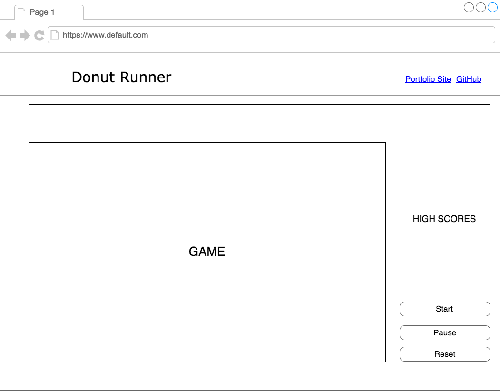

# Donut Runner

Donut runner is an infinite run game. Homer Simpson loves donuts..."Mmm, donuts". He will do anything to get one including running and avoiding obstacles.

## MVP

- [ ] Start, pause, and reset the game after they get game over.
- [ ] Choose a difficulty level that will change the patterns and frequency of obstacles.
- [ ] Scoring and saving high scores locally.
- [ ] Instructions explaining the story and controls of the game
- [ ] Production README

## Technologies

`donut_runner.js` will be implemented with the following technologies:

- Vanilla JavaScript for game logic
- HTML5 Canvas for rendering

In addition to the entry file, there will be the following scripts involved in this project:

- `runner.js`: provides the controls and actions of the runner object
- `game.js`: rendering of the game
- `obstacle.js`: this script will provide the basis of all obstacles
- `difficulty.js`: given the difficulty choice, this script will render obstacles at random

## Wireframe
The app will feature a main screen with the game, navigation options, and graphics to follow the theme of the game.

## Implementation Timeline

**Day 1**: Setup all necessary Node modules, including getting webpack up and running. Create the additional scripts of the game. Setup `runner.js` to display on the screen and jump.

**Day 2**: Have game begin to infinitely move forward only. Create obstacles that the runner must avoid and determine if they are colliding.

**Day 3**: Difficulty settings that will randomize and possibly speed up the game. High scores can also be tracked.

**Additional Time**: Touch up and make it look nice
